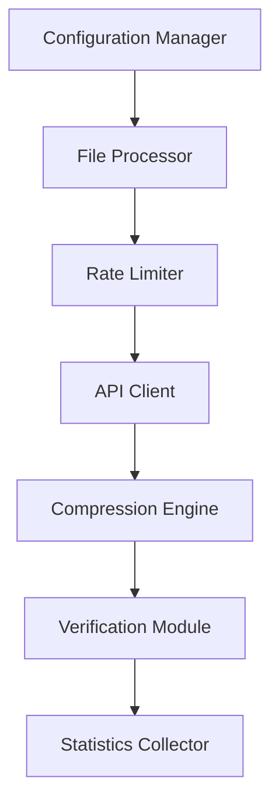
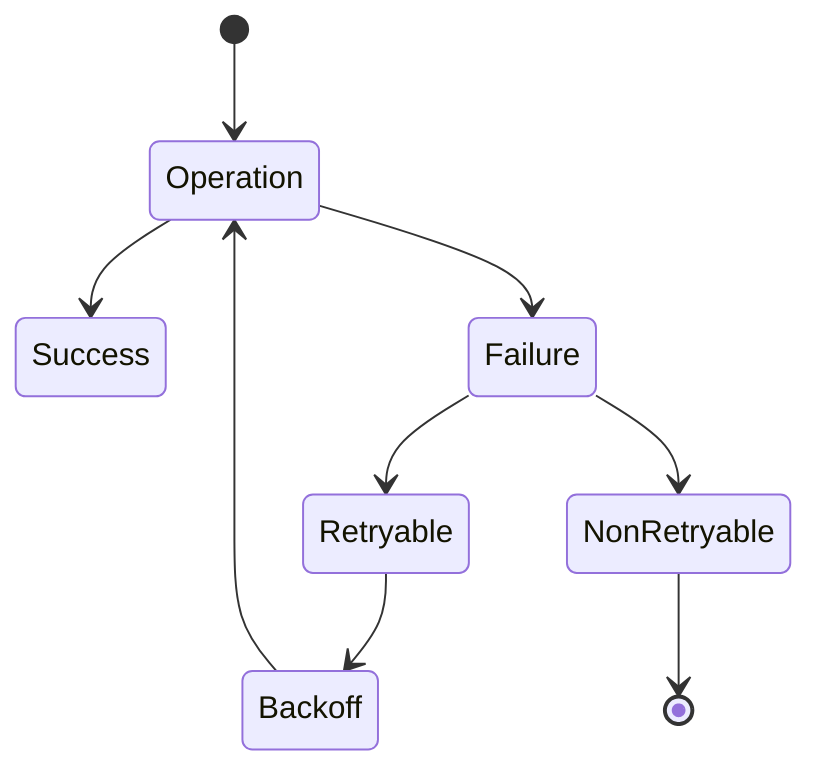

# DataHub File Compression Utility

A robust utility for compressing large files stored in DataHub using their REST API. This solution provides safe, incremental compression with comprehensive error handling, rate limiting, and detailed logging.

## Table of Contents
- [Overview](#overview)
- [Features](#features)
- [Architecture](#architecture)
- [Prerequisites](#prerequisites)
- [Installation](#installation)
- [Configuration](#configuration)
- [Usage](#usage)
- [Error Handling](#error-handling)
- [Monitoring and Logging](#monitoring-and-logging)
- [Performance Considerations](#performance-considerations)
- [Troubleshooting](#troubleshooting)
- [Security](#security)
- [Contributing](#contributing)

## Overview


This utility implements a comprehensive file compression solution for DataHub, following best practices for enterprise-grade applications.

## Features

✅ REST API integration with exponential backoff
✅ Configurable batch processing
✅ Multi-threaded operation
✅ Comprehensive error handling
✅ Detailed logging and statistics
✅ Dry-run capability
✅ Progress tracking
✅ Metadata preservation
✅ Verification steps

## Architecture



## Prerequisites

- Python 3.8+
- PostgreSQL database access
- DataHub API credentials
- Required Python packages (see requirements.txt)

## Installation

Clone the repository:

```bash
git clone [repository-url]
cd datahub-compression-utility
```

Create and activate virtual environment:

```bash
python -m venv venv
source venv/bin/activate  # On Windows: venv\Scripts\activate
```

Install requirements:

```bash
pip install -r requirements.txt
```

Set up configuration:

```bash
cp config.sample.json config.json
# Edit config.json with your settings
```

## Configuration

### Basic Configuration (config.json)

```json
{
    "api_base_url": "https://your-datahub-api-url",
    "api_key": "your-api-key",
    "db_params": {
        "dbname": "your_database",
        "user": "your_username",
        "password": "your_password",
        "host": "your_host",
        "port": 5432
    }
}
```

### Validate Configuration

```bash
python validate_config.py config.json
```

## Usage

### Basic Usage

```bash
python compression_utility.py config.json <month> <year> [options]
```

### Options

- `--dry-run`: Test run without making changes
- `--batch-size`: Number of files to process simultaneously (default: 100)
- `--size-threshold`: Minimum file size to compress (default: 1MB)

## Examples

```bash
# Process files from June 2023
python compression_utility.py config.json 6 2023

# Dry run with custom batch size
python compression_utility.py config.json 6 2023 --dry-run --batch-size 50
```

## Error Handling



### Error Recovery Process

- Automatic retry with exponential backoff
- Transaction rollback on failure
- Detailed error logging
- State preservation

## Monitoring and Logging

### Log Levels

- **INFO**: General processing information
- **WARNING**: Non-critical issues
- **ERROR**: Processing failures
- **CRITICAL**: System-level issues

### Statistics

- Compression ratios
- Processing times
- Success/failure rates
- Space saved

## Performance Considerations

### Optimization Features

- Batch processing
- Connection pooling
- Memory management
- Multi-threading

### Recommended Settings

```python
OPTIMAL_BATCH_SIZE = 100
MAX_THREADS = 4
RATE_LIMIT_DELAY = 1  # second
```

## Troubleshooting

### Common Issues and Solutions

#### API Rate Limiting

```python
# Adjust in config.json
"rate_limiting": {
    "base_delay": 1,
    "max_delay": 60,
    "factor": 2
}
```

#### Memory Usage

- Reduce batch size
- Monitor with logging
- Use resource monitoring

#### Database Connection

- Check credentials
- Verify network access
- Test connection limits

## Security

### Best Practices

- Secure credential storage
- API key rotation
- Audit logging
- Access control
- Data encryption

### Configuration Security

- Use environment variables
- Restrict config file permissions
- Regular security audits

## Contributing

1. Fork the repository
2. Create a feature branch

```bash
git checkout -b feature/your-feature-name
```

3. Commit changes

```bash
git commit -m "Add your feature description"
```

4. Push to branch

```bash
git push origin feature/your-feature-name
```

5. Create Pull Request

### Development Guidelines

- Follow PEP 8 style guide
- Add unit tests
- Update documentation
- Include error handling


## Support

For support, please contact hazem.zaoun@gmail.com


Last Updated: November 13, 2024
Version: 1.0.0
