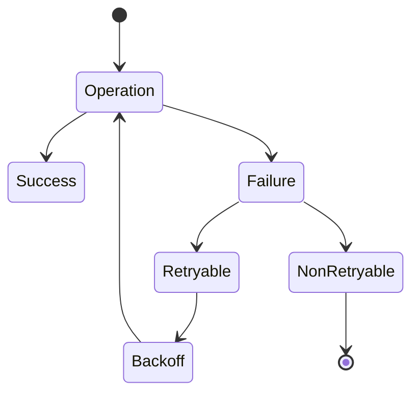
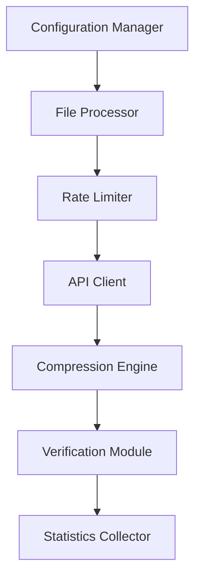
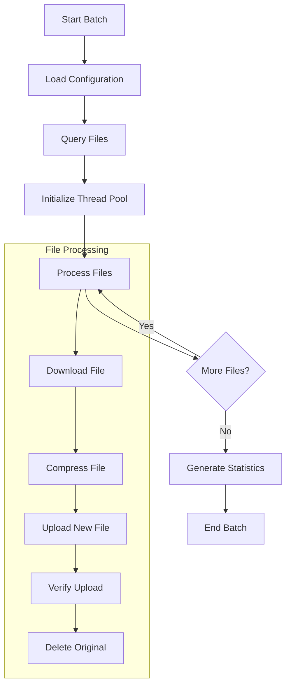

# DataHub File Compression Utility

A robust utility for compressing large files stored in DataHub using their REST API. This solution provides safe, incremental compression with comprehensive error handling, rate limiting, and detailed logging.

## Table of Contents
- [Features](#features)
- [Process Flow](#process-flow)
- [Project Structure](#project-structure)
- [Prerequisites](#prerequisites)
- [Installation](#installation)
- [Configuration](#configuration)
- [Usage](#usage)
- [Monitoring and Logging](#monitoring-and-logging)
- [Error Handling](#error-handling)
- [Performance Considerations](#performance-considerations)
- [Security](#security)
- [Troubleshooting](#troubleshooting)


## Features

- ✅ REST API integration with exponential backoff
- ✅ Configurable batch processing with multi-threading
- ✅ Comprehensive error handling and retry mechanisms
- ✅ Detailed logging with rotation
- ✅ Progress tracking and statistics
- ✅ File integrity verification
- ✅ Environment-based configuration
- ✅ Dry-run capability for testing

## Process Flow

### Overall Process


### Error Handling Flow



### Data Flow Architecture


### Batch Processing Workflow


## Project Structure

CopysasCompression/
├── .env.sample                # Environment variables template
├── config/ 
│   └── config.sample.json     # Configuration template
├── src/ 
│   ├── utils/ 
│   │   ├── __init__.py         # Package initialization
│   │   └── logging_config.py  # Logging configuration
│   ├── compression_utility.py # Main compression logic
│   └── validate_config.py     # Configuration validation
├── tests/ 
│   └── __init__.py            # Package initialization
└── requirements.txt           # Python dependencies


## Pre-requisites

- Python 3.8+
- PostgreSQL database access
- DataHub API credentials
- Required Python packages (see `requirements.txt`)

## Installation

1. **Clone the repository**:
```bash
   git clone [repository-url]
   cd sasCompression
```
2. **Create and activate virtual environment:**
```bash
python -m venv .venv
source .venv/bin/activate  # On Windows: .venv\Scripts\activate
```

3. **Install Requirements**
```bash
pip install -r requirements.txt
```
4. **Set up Configuration**
```bash
# Copy configuration templates
cp .env.sample .env
cp config/config.sample.json config/config.json

# Edit .env and config.json with your settings

```
## Configuration

### Environment Variables (.env)
Configure your environment by editing the `.env` file with your specific settings:

- **API credentials**
- **Database connection details**
- **Performance parameters**
- **Logging preferences**

### Configuration File (config.json)
Adjust the configuration file for:

- **Logging rotation settings**
- **Performance tuning**
- **API retry strategies**
- **File processing parameters**

## Usage

### Validate Configuration
Before running the utility, validate your configuration:

```bash
python validate_config.py config/config.json
```

### Basic Usage

```bash 
python compression_utility.py <month> <year> [options]
```

### Options
- `--dry-run`: Test run without making changes
- `--batch-size`: Number of files to process simultaneously (default: 100)
- `--size-threshold`: Minimum file size to compress (default: 1MB)
- `--log-level`: Set logging level (`DEBUG`/`INFO`/`WARNING`/`ERROR`)

### Examples

```bash
# Process files from June 2023
python compression_utility.py 6 2023

# Dry run with custom batch size
python compression_utility.py 6 2023 --dry-run --batch-size 50

# Process with detailed logging
python compression_utility.py 6 2023 --log-level DEBUG

```

## Monitoring and Logging

### Log Files
- Main log file: compression_script.log
- Rotated logs: compression_script.log.1, compression_script.log.2, etc.
- Log format: timestamp - level - message

### Statistics
The utility provides detailed statistics including:
- Files processed/failed
- Compression ratios
- Processing time
- Space saved

## Error Handling

The utility implements comprehensive error handling:
- Automatic retries with exponential backoff
- Detailed error logging
- Transaction rollback on failures
- File integrity verification

## Performance Considerations

### Optimization Features
- Batch processing with configurable size
- Multi-threading support
- Memory-efficient streaming
- Connection pooling
- Rate limiting with exponential backoff

### Recommended Settings
```python
# Default performance settings
OPTIMAL_BATCH_SIZE = 100
MAX_THREADS = 4
RATE_LIMIT_DELAY = 1  # second
CHUNK_SIZE = 8192  # bytes
```

## Resource Management

- **Automatic connection cleanup**
- **Memory usage monitoring**
- **Thread pool management**
- **Configurable timeout settings**

## Security

### Best Practices

#### Secure Credential Storage
- **Environment variables**
- **Encrypted configuration**

#### API Key Protection
- **Automatic key rotation**
- **Access logging**

#### File Handling
- **Integrity verification**
- **Secure deletion**

#### Access Control
- **Role-based permissions**
- **Audit logging**

## Troubleshooting

### Common Issues and Solutions

1. Configuration Issues
   - Run validate_config.py
   - Check .env file settings
   - Verify database credentials
   - Ensure correct file permissions

2. Performance Issues
   - Adjust batch size in config.json
   - Modify thread count based on system resources
   - Check network connectivity
   - Monitor system resources

3. API Issues
   - Verify API credentials
   - Check rate limits
   - Monitor API responses
   - Review error logs

4. Database Issues
   - Verify connection settings
   - Check database permissions
   - Monitor connection pool
   - Review transaction logs

### Logging Levels
- DEBUG: Detailed debugging information
- INFO: General operational information
- WARNING: Minor issues that don't affect processing
- ERROR: Serious issues that need attention
- CRITICAL: System-level failures

